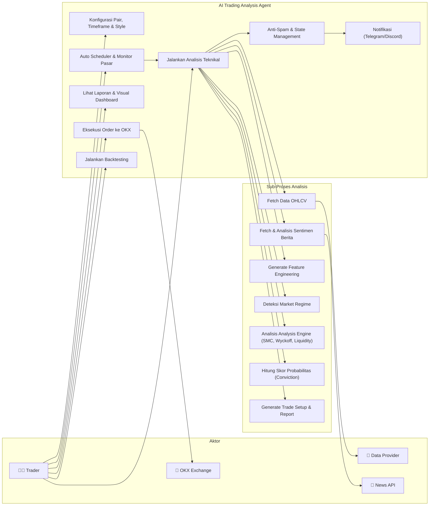
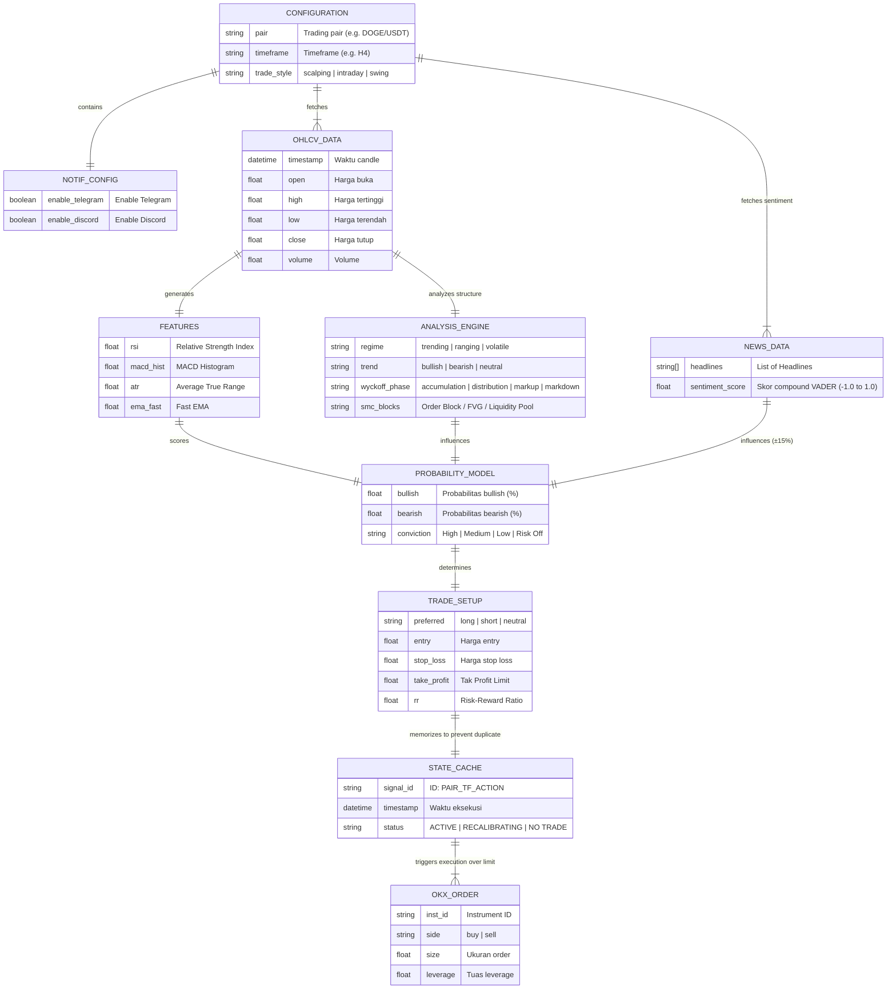
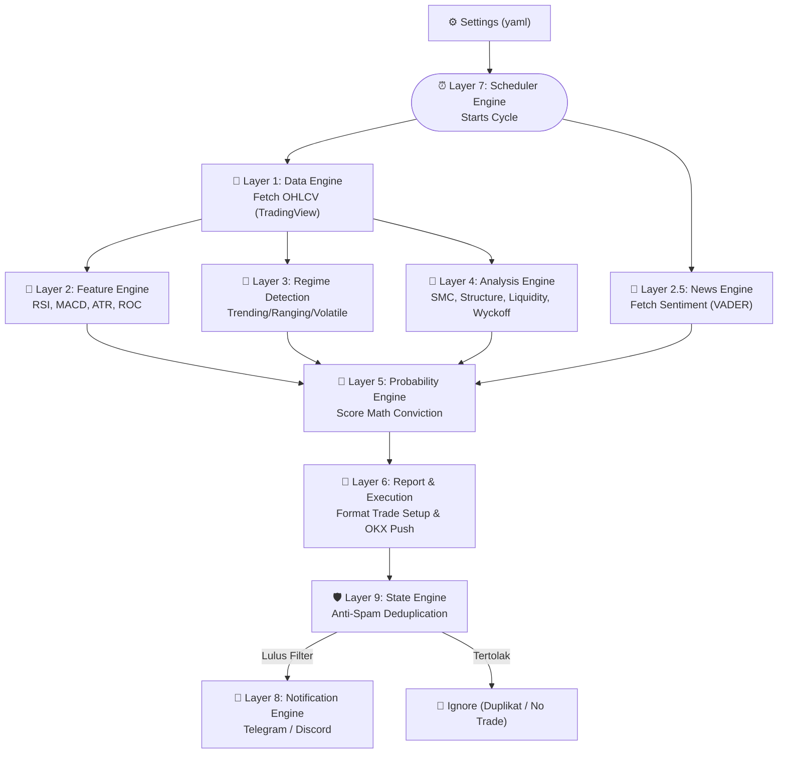

# 🤖 AntiGravity: AI Trading Analysis Agent

[](https://www.python.org/downloads/)
[](https://opensource.org/licenses/MIT)

**AntiGravity AI Trading Analysis Agent** adalah sistem intelijen buatan tingkat lanjut yang dirancang khusus untuk menghasilkan laporan analisis teknikal terstruktur, melakukan pemindaian pasar secara masal (bulk scanning), dan memberikan rekomendasi probabilitas tinggi (setup trading) berdasarkan data OHLCV. 

Sistem ini sangat fleksibel dan dapat digunakan untuk mendeteksi *alpha* (peluang profit) di berbagai pasar finansial, termasuk **Crypto (CEX & DEX seperti Solana/Base), Forex, Saham (Stocks), dan Indeks global**.

---

## ✨ Fitur Unggulan

1. **Arsitektur 6-Layer Analisis**:
   - **Data Engine**: Mengambil data teraktual via sintaks TradingView (`tvdatafeed`).
   - **Feature Engine**: Ekstraksi fitur teknikal (RSI, MACD, ATR, ROC, dll).
   - **Regime Detection**: Mengidentifikasi *Market Regime* (Trending, Ranging, Volatile).
   - **Analysis Engine**: Analisis struktur harga (*Market Structure*), fase Wyckoff, Supply/Demand, Likuiditas, dan *Smart Money Concepts* (SMC/FVG).
   - **Probability Engine**: Mengkalkulasi metrik probabilitas dengan kesadaran *Timeframe* (TF) dan membobot rasio *Conviction* (Keyakinan: *High, Medium, Low*).
   - **Report/Execution Engine**: Membuat ringkasan laporan trading komprehensif, setup Entry/TP/SL presisi (mempertimbangkan Consequent Encroachment dari FVG), serta eksekusi otomatis.

2. **Dukungan Multi-Market**: Menjangkau pasar Crypto, Forex, Saham, hingga Indeks.
3. **Web Dashboard Interaktif**: Monitor status pasar secara *real-time* langsung di peramban (browser) berkat sistem Dashboard komprehensif, menampilkan filter likuiditas, kapitalisasi (FDV), dan tren.
4. **Modul Eksekusi OKX**: Memungkinkan simulasi dan *Live Trading* melalui API OKX, dilengkapi penyesuaian Manajemen Resiko (*Risk Management*), Leverage, arah order (Long/Short), dan kalkulasi *Initial Margin*.
5. **Multi-Threaded Bulk Scanner**: Mampu memindai hingga **200 pasang aset** dalam ~5 menit dengan mode ⚡ Fast, dilengkapi rate-limiter cerdas, retry logic, dan global macro caching.

---

## 📁 Struktur Direktori Proyek (Deep Dive)

Sistem dibangun berdasarkan arsitektur Modular 6-Layer, di mana masing-masing bagian diletakkan dalam *folder* terpisah sesuai fungsinya (*Separation of Concerns*). Berikut adalah pemetaan detail seluruh berkas internal yang menghidupi kecerdasan buatan ini:

```text
ai-trading-analysis-agent/
│
├── ⚙️ Skrip Eksekusi Utama
│   ├── app.py                      # Menjalankan Web Server (UI GUI Dashboard) di localhost.
│   ├── main.py                     # Skrip CLI murni untuk menghasilkan Log teks per 1 pasang koin.
│   └── scanner.py                  # Mesin utama Bulk Scanner (Pemindai masal) berkinerja multi-threading.
│
├── ⚙️ Pengaturan Pusat
│   └── config/
│       └── settings.yaml           # Target kontrol Anda (TF, style, Market, API Key OKX, mode simulasi/live).
│
├── 🧠 Layer 1: Data Engine
│   └── data_engine/                # Modul penarik Data Riil
│       ├── market_data.py          # Logika formatting dan validasi susunan Candlestick (OHLCV).
│       └── tradingview_connector.py# Modul jembatan (tvdatafeed) penghubung ke data API TradingView.
│
├── 🧠 Layer 2: Feature Engine
│   └── feature_engine/             # Mengolah harga mentah menjadi landasan fitur teknikal
│       ├── feature_extractor.py    # Koordinator pemanggilan ekstraksi semua indikator.
│       ├── indicator_features.py   # Menghitung MACD, RSI, ATR, ROC, dan Exponential Moving Averages (EMAs).
│       ├── liquidity_features.py   # Mengukur lonjakan volume, anomali volatilitas, dan deviasi likuiditas.
│       └── structure_features.py   # Mendeteksi Swing Highs dan Swing Lows (Puncak/Lembah Ayunan).
│
├── 🆕 Layer 2.5: News Engine
│   └── news_engine/                # Modul Analisis Sentimen Berita Terkini
│       ├── news_fetcher.py         # Tarik aliran berita dari NewsAPI / CryptoPanic.
│       ├── sentiment_analyzer.py   # Analisa sentimen teks menggunakan algoritma VADER atau HuggingFace.
│       └── sentiment_score.py      # Gabungkan metrik skor sentimen berita ke perhitungan di probability_model.py.
│
├── 🧠 Layer 3: Regime Detection
│   └── market_regime_detection/    # Mengklasifikasikan kepribadian pasar saat ini
│       ├── regime_classifier.py    # Menentukan status umum secara persentase (Trending vs Choppy vs Volatile).
│       ├── trend_detector.py       # Memindai kekuatan tren secara absolut mengandalkan Average.
│       └── volatility_model.py     # Mengukur anomali ledakan volalitas (*Breakout Indicator*).
│
├── 🧠 Layer 4: Analysis Engine
│   └── analysis_engine/            # Otak/Inti Logika Analisis Trading yang Paling Mendalam
│       ├── smc_analysis.py         # Mendeteksi Fair Value Gaps (FVG) dan *Consequent Encroachment* (Titik tengah FVG).
│       ├── market_structure.py     # Mengakui perpindahan momentum/fraktal (ChoCh) maupun bias terusan (BoS).
│       ├── liquidity_analysis.py   # Menemukan letak Kolam Uang / Stop loss hunter (Buy-Side/Sell-Side Liquidity).
│       ├── supply_demand.py        # Memetakan Area Pemesanan Masal / *Order Blocks* (Supply dan Demand).
│       └── wyckoff_phase.py        # Mengenali Fase Bandar Wyckoff (Akumulasi, Distribusi, Markup, Markdown).
│
├── 🧠 Layer 5: Probability Model
│   └── probability_engine/         # Hakim Pengambil Keputusan Terakhir
│       ├── probability_model.py    # Menyatukan data Layer 1 s/d Layer 4 & membobot probabilitas Multi-Timeframe.
│       └── scoring_engine.py       # Menghasilkan kalkulasi *Conviction* Akhir (Menaruh label High/Medium/Low Conviction).
│
├── 🧠 Layer 6: Execution & Reporting
│   ├── report_engine/              # Pusat visualisasi Data Tekstual Console
│   │   ├── analysis_report.py      # Templat/skema struktur representasi data objek.
│   │   └── report_formatter.py     # Mencetak *"16-Tahap Analisis Textually"* yang estetik & penuh warna di Konsol Terminal.
│   │
│   └── execution_engine/           # (Modul Opsional) Eksekusi robot otomatis OKX
│       ├── okx_integration.py      # Pengendali *Risk Management*, pendikte batas keamanan Margin, dan kalkulator *Leverage*.
│       └── okx_client.py           # Eksekutor yang mengirimkan payload sinyal Long/Short langsung dilarikan menuju Web OKX.
│
├── 🆕 Layer 7: Scheduler Engine
│   └── scheduler_engine/           # Rutinitas Perulangan (Auto-looping)
│       ├── auto_scheduler.py       # Memanfaatkan APScheduler — menjalankan scanning setiap X menit secara otomatis.
│       ├── market_monitor.py       # Memantau dan mendeteksi perubahan sinyal antar waktu running (Run).
│       └── alert_trigger.py        # Menyaring sinyal spesifik "High Conviction" sebelum memutuskan melempar Notifikasi.
│
├── 🆕 Layer 8: Notification Engine
│   └── notification_engine/        # Rantai Output Penyiaran Alert
│       ├── telegram_notifier.py    # Melempar rangkuman eksekusi sinyal ke akun Telegram Bot khusus Anda.
│       ├── discord_notifier.py     # Eksekutor opsional: mem-broadcast pesan via Webhook Discord Server.
│       └── message_formatter.py    # Mengubah format objek mentah teks sinyal agar terlihat rapi, berwama & informatif.
│
├── 🆕 Layer 9: State Engine
│   └── state_engine/               # Anti-Spam Signal & Sistem Memori Riwayat
│       ├── signal_cache.py         # Menyimpan status sinyal historis terakhir yang tercapai (menggunakan SQLite / Redis).
│       └── dedup_filter.py         # Mengeblok perulangan alert kembar (duplikat) / mencegah spam notifikasi konstan.
│
├── 🧪 Backtesting & Simulator (Opsional)
│   └── backtesting_engine/         # Alat pengujian simulasi masa lalu
│       ├── backtest_runner.py      # Siklus iterasi algoritma tes.
│       ├── strategy_simulator.py   # Pengubah sinyal teks menjadi format entri eksekusi simulasi dompet kosong.
│       └── performance_metrics.py  # Kalkulator Metrik keberhasilan (% Win-Rate, *Drawdown*, Profit & Loss).
│
└── 🌐 Modul Web Dashboard UI
    ├── static/                     
    │   ├── css/style.css           # Berkas desain (*Styling*) keindahan UI aplikasi web Anda.
    │   └── js/app.js               # Logika jembatan *Front-end*, bertindak menarik JSON dari scanner ke layar website.
    │
    └── templates/                  
        └── index.html              # *Blueprint Main Layout* / Rangkaian struktur dasar Tabel Market pemindai Anda.
```

---

## 💻 Prasyarat Sistem

Sebelum mulai menjalankan sistem ini, pastikan spesifikasi perangkat Anda memenuhi kriteria berikut:
*   **Python:** Versi 3.10 atau yang lebih baru.
*   **Konektivitas Internet Stabil:** Digunakan untuk *scraping* data *real-time* dan koneksi TradingView/API.
*   (Opsional) Kredensial akun **TradingView** untuk mencegah _rate-limit_ akibat penggunaan sesi _anonymous_.

---

## 🛠 Instalasi

Unduh atau cloning repositori ini, kemudian bangun *Virtual Environment* untuk memastikan tatanan arsitektur Pustaka Python (_library_) terjaga kebersihannya:

```bash
# 1. Buat virtual environment (satu kali saja)
py -3 -m venv .venv

# 2. Aktifkan virtual environment (Windows)
.\.venv\Scripts\activate

# 3. Instal semua dependencies yang diperlukan
py -3 -m pip install -r requirements.txt
```

---

## 🚀 Cara Penggunaan Sehari-hari (Menggunakan Web Dashboard)

Apabila Anda mau menggunakan versi Antarmuka Pengguna/UI (sangat direkomendasikan untuk visibilitas data massal), ikuti 3 langkah berikut setiap kali membuka komputer:

### 1. Masuk Folder & Aktifkan Lingkungan VENV
Bukalah terminal `Command Prompt` (CMD) / `PowerShell`. Jalankan skrip inisialisasi:
```bash
cd ai-trading-analysis-agent
.\.venv\Scripts\activate
```

### 2. Jalankan Modul Scanner Pasar dan Server Web Lokal
Anda harus menjalankan server utamanya, sembari memanggil modul pemindai (bisa disesuaikan spesifik kategori pasarnya):
```bash
# A. Jalankan Server Web Pusat
py -3 app.py

# B. (Buka Jendela Terminal BARU) -> aktifkan .venv -> lalu jalankan scanner:
# ⚡ Fast scan (default) - 200 crypto pairs dalam ~5 menit
py -3 scanner.py --market crypto --timeframe 1h --style swing

# 🔍 Full analysis (lebih lambat, tapi include HTF trend, news, correlation)
py -3 scanner.py --market crypto --timeframe 1h --style swing --full
```

*Tips:* Anda dapat mengatur jumlah thread dan memilih market spesifik:
```bash
# Crypto 200 pairs, 8 threads (rekomendasi aman)
py -3 scanner.py --market crypto --timeframe 1h --style swing --threads 8

# Forex, Saham, Index
py -3 scanner.py --market forex --timeframe 1h --style swing
py -3 scanner.py --market stocks --timeframe 1d --style swing
py -3 scanner.py --market indexes --timeframe 1d --style swing

# Semua pasar sekaligus (crypto + forex + stocks + indexes)
py -3 scanner.py --market all --timeframe 1h --style swing
```

### 3. Pantau Dashboard Pemindai via Browser 🌐
Biarkan kedua Terminal hitam tadi **tetap nyala dan jangan dikesempingkan (di-close)**. Buka Google Chrome atau Microsoft Edge untuk mengakses antarmuka Anda di:
👉 **[http://localhost:5000](http://localhost:5000)**

---

## ⚙️ Cara Menjalankan Versi Teks Murni (Bagi Programmer/Trader Log)

Jika Anda ingin melihat rincian kalkulasi data struktural tiap langkah per langkah dalam format *Log Analysis* konvensional, panggil skrip utama `main.py` menggunakan argumen `--pair`:

```bash
py -3 main.py --pair BINANCE:BTCUSDT --timeframe 1h --limit 500
```
(Akan memberikan respons berupa rincian lengkap hingga pencetakan *Setup Signal* probabilitasnya).

---

## 📝 Konfigurasi Inti (`config/settings.yaml`)

Edit _file_ utama konfigurasinya (berada di `config/settings.yaml`) untuk menyesuaikan metode trading default *Agent* Anda:
```yaml
pair: BTC/USDT           # Pasangan Dasar
timeframe: H4            # TF Dasar Evaluasi
limit: 500               # Indeks Lilin Maksimal 
trade_style: swing       # Opsi Style: scalping, intraday, swing, position
# -- Konfigurasi Proteksi Limit TradingView --
tv_username: ""          # Disarankan log-in
tv_password: ""          
```

---

## 📊 Pair / Symbol Format yang Didukung Penuh

Dapur pacu mesin membaca API _Ticker_ persis sebagaimana format penamaan grafik dalam **TradingView**. 

### Format Wajib (Eksplisit/Direkomendasikan):
Gunakan sintaks `NAMA_BURSA:NAMA_SYMBOL` untuk menghilangkan ketidaktepatan data likuiditas harga.

*   **Sektor Crypto:** `BINANCE:BTCUSDT`, `BYBIT:ETHUSDT`, `OKX:SOLUSDT`, `KUCOIN:KASUSDT`
*   **Sektor Saham (Stocks):** `NASDAQ:AAPL`, `NASDAQ:MSFT`, `NYSE:TSLA`, `NYSE:NVDA`
*   **Sektor Valuta Asing (Forex):** `FX_IDC:EURUSD`, `FX_IDC:GBPUSD`, `OANDA:USDJPY`, `OANDA:USDCAD`
*   **Sektor Bursa Index:** `SP:SPX`, `NASDAQ:NDX`, `TVC:DXY` (Index Dollar)

### Rentang Waktu (Timeframes Supported):
*   **Intraday Trading:** `1m`, `3m`, `5m`, `15m`, `30m`
*   **Swing / Makro Trading:** `1h`, `2h`, `3h`, `4h`, `1d`, `1w`, `1mo`

---

## 🔐 Integrasi Eksekusi ke OKX Exchange (Advanced Setup)

Agent ini dirancang siap menyambungkan hasil analisis probabilitas menembus dompet dan eksekusi pada Bursa Centralized (**OKX**).
**Pertama**, simpan kunci akses (API) OKX Anda dalam sesi *Environment (ENV)* *Terminal*/Komp Anda berulang secara rahasia:
```powershell
$env:OKX_API_KEY="..."
$env:OKX_API_SECRET="..."
$env:OKX_PASSPHRASE="..."
```

### A. Mengatur Eksekusi Pasar Spot (Fisik)
Pastikan target pair-nya mengikut *Cash* tanpa kata "SWAP", nilai order _Size_ adalah `0`:
```yaml
okx:
  enable: true
  mode: simulated       # Gunakan 'live' sewaktu ingin pakai dana riil
  inst_id: "BTC-USDT"   # HANYA BASE-QUOTE PAIR (TANPA SWAP)
  trade_mode: cash 
  order_notional: 10    # MEMBELI senilai 10 USDT
  order_size: 0         # <- Wajib '0' jika notional digunakan
  leverage: 0           # Leverage dibiarkan 0 (tidak valid di Spot)
```

### B. Mengatur Eksekusi Pasar Futures/Derivatif (SWAP)
Gunakan wajib opsi `order_size` (Nilai Lot Kontrak) dengan akhiran _SWAP_ di instumennya:
```yaml
okx:
  enable: true
  mode: simulated
  inst_id: "BTC-USDT-SWAP" # WAJIB TULIS SWAP UNTUK FUTURES
  trade_mode: isolated
  mgn_mode: isolated
  leverage: 5              # Atur tuas Margin Anda (contoh 5x)
  order_size: 1            # Berapa buah lot kontraknya? (Angka Bulat: 1, 2, dll)
  order_notional: 0        # <- WAJIB '0'
  pos_side: auto           # AI yang tentukan nge-Long atau nge-Short
  submit: preferred
```

### C. Penting! Menghargai Margin OKX Futures
_1 Kontrak di OKX (saat mengatur order_size = 1) BUKAN berarti 1 keping full koinnya. Tiap koin nilai kontraknya diregulasi secara berbeda-beda._

*   **BTC-USDT-SWAP** : 1 Kontrak = `0.01 BTC` (sekitar $900 s/d $1000an)
*   **ETH-USDT-SWAP** : 1 Kontrak = `0.1 ETH` (kisaran $300 USDT)
*   **SOL-USDT-SWAP** : 1 Kontrak = `1 SOL` (kisaran $150 s/d $180)
*   **DOGE-USDT-SWAP**: 1 Kontrak = `1000 DOGE` (sekitar $15 hingga $150)

> **Contoh Kalkulasi Nyata (DOGE-USDT-SWAP)**:
> - **Harga saat ini**: $0.093
> - **Nilai Asli (Notional)** untuk 1 Kontrak (1000 DOGE): $0.093 * 1000 = **$93.00**
> - **Kewajiban Uang Modal/Tahapan (Margin)** jika leverage **20x**: `$93.00 / 20 = $4.65`
> 
> *Artinya saldo dompet Futures Anda cuman dipotong `$4.65` saja demi menahan posisi senilai `1000 DOGE`. Namun perhatikan Likuidasinya.*

### D. Troubleshooting SSL OKX
Jika muncul error seperti `CERTIFICATE_VERIFY_FAILED`:
1. Sesuaikan sinkronisasi **Jam Komputer Windows Anda** ke Zona waktu internasional secara _Update Now_.
2. Jika berlanjut, pada config rubah parameter `ssl_verify: false` (Peringatan: kurang aman dari segi security).

---

## ⚡ Scanner Performance Tuning

Scanner telah dioptimasi untuk memindai **200 pasang crypto** (dari CoinMarketCap top market cap) dengan kecepatan tinggi. Daftar pair disimpan di `ctval.txt`.

### Mode Scan

| Mode | Flag | Fitur | Estimasi 200 pairs |
|------|------|-------|--------------------|
| **⚡ Fast** (default) | `--fast` | Skip HTF trend, news, per-pair correlation | **~3-5 menit** |
| **🔍 Full** | `--full` | Include semua: HTF, news sentiment, BTC-DXY/SPX correlation | **~15-20 menit** |

### Parameter Scanner

| Flag | Pilihan | Default | Keterangan |
|------|---------|---------|------------|
| `--market` | `crypto`, `forex`, `stocks`, `indexes`, `all` | `crypto` | Pasar target |
| `--timeframe` | `1m`-`1mo` | `1h` | Timeframe analisis |
| `--style` | `scalping`, `intraday`, `swing` | `swing` | Gaya trading |
| `--threads` | `1`-`15` | `10` | Jumlah thread paralel |
| `--fast` | - | `on` | Mode cepat (default aktif) |
| `--full` | - | `off` | Mode analisis lengkap |

### Rekomendasi Thread

| Threads | Kecepatan | Risiko Rate-Limit |
|---------|-----------|-------------------|
| `5-8` | ~0.5-0.8 pairs/sec | ✅ Sangat aman |
| `10` | ~1.0-1.5 pairs/sec | ✅ Aman (default) |
| `12-15` | ~1.5-2.0 pairs/sec | ⚠️ Sesekali 429 error |

### Arsitektur Anti Rate-Limit

Scanner menggunakan beberapa mekanisme untuk mencegah pemblokiran dari TradingView:

1. **Global Rate Limiter** (`tradingview_connector.py`): Jeda minimum 150ms antar setiap request API, berlaku untuk semua thread.
2. **Global Macro Cache** (`main.py`): Data DXY/VIX/SPX di-cache 5 menit — tidak perlu di-fetch ulang per pair (menghemat ~300 API call).
3. **Retry with Backoff** (`market_data.py`): 2x retry per exchange dengan jeda eksponensial.
4. **Exchange Fallback Chain**: BINANCE → OKX → BYBIT → MEXC → GATEIO → KuCoin.
5. **News Cache** (`news_fetcher.py`): Hasil berita di-cache 15 menit.
6. **OHLCV Data Cache**: Cache 5 menit per pair/timeframe di `tradingview_connector.py`.
7. **Thread-Safe Singleton**: Instance TvDatafeed tunggal, dilindungi lock, digunakan semua thread.

### Daftar 200 Pair (`ctval.txt`)

Daftar pair diambil dari **CoinGecko/CoinMarketCap top market cap**, dengan pengecualian:
- ❌ Stablecoins (USDT, USDC, DAI, USDE, USDD, dll)
- ❌ Gold/Silver tokens (XAUT, PAXG, KAU, KAG)
- ❌ Institutional/Treasury tokens (BUIDL, JTRSY, OUSG, dll)
- ❌ Non-tradeable tokens (Figure HELOC, Canton, dll)

Untuk memperbarui daftar, edit file `ctval.txt` dengan format: `SYMBOL-USDT-SWAP:BINANCE`

---

## 📰 Layer 2.5: News Sentiment Engine (NLP)

Robot sekarang tidak hanya membaca *Candlestick* — ia juga membaca **berita**. Modul `news_engine/` menarik *headline* terkini secara otomatis lewat pustaka `gnews` (tanpa API key), menganalisa sentimen teks kalimat menggunakan algoritma **VADER NLP**, dan menginjeksikan hasilnya ke dalam perhitungan skor probabilitas (`probability_model.py`).

> **Catatan:** Pada mode `--fast` (default scanner), news sentiment di-skip untuk kecepatan. Gunakan `--full` atau `main.py` untuk analisis lengkap termasuk berita.

**Cara kerjanya:**
1. Saat `main.py` atau `scanner.py --full` memproses sebuah pair, sistem memanggil `news_engine.sentiment_score.get_asset_sentiment()`.
2. `gnews` menarik 5 headline terbaru terkait aset tersebut.
3. `vaderSentiment` menghitung skor compound `[-1.0, +1.0]` per headline, lalu diambil rata-ratanya.
4. Skor ini mempengaruhi Conviction akhir hingga **±15%** pada model probabilitas.
5. Sistem memiliki *cache* internal 15 menit untuk mencegah pemanggilan berlebihan ke `gnews`.

**Konfigurasi (`config/settings.yaml`):**
```yaml
news:
  enable: true
  source: "gnews"          # Gratis, tanpa token
  cryptopanic_token: ""    # Opsional untuk pengembangan masa depan
```

---

## ⏰ Layer 7: Auto Scheduler Engine (Loop Otomatis)

Tidak perlu lagi mengetik perintah scanner berulang kali. Modul `scheduler_engine/` memungkinkan robot berjalan terus-menerus secara otomatis, melakukan scanning berkala, dan *hanya* mengirim notifikasi saat ditemukan sinyal berkeyakinan tinggi.

**Cara menjalankan Auto-Loop:**
```bash
cd ai-trading-analysis-agent
.\.venv\Scripts\activate
py -3 scheduler_engine/auto_scheduler.py
```

**Argumen yang didukung:**

| Flag | Pilihan | Default | Keterangan |
|---|---|---|---|
| `--market` | `crypto`, `forex`, `stocks`, `indexes`, `all` | `crypto` | Pasar target pemindai |
| `--timeframe` | `5m`, `15m`, `1h`, `4h`, `1d`, dll | `1h` | Timeframe analisis |
| `--style` | `scalping`, `intraday`, `swing` | `swing` | Gaya trading |
| `--interval` | angka (menit) | `60` | Jeda perulangan otomatis |

**Contoh penggunaan fleksibel:**
```bash
# Default: Crypto 1H Swing, diulang setiap 60 menit
py -3 scheduler_engine/auto_scheduler.py

# Crypto 15M Scalping, diulang setiap 15 menit
py -3 scheduler_engine/auto_scheduler.py --timeframe 15m --style scalping --interval 15

# Forex 4H Swing, diulang setiap 4 jam
py -3 scheduler_engine/auto_scheduler.py --market forex --timeframe 4h --style swing --interval 240

# Semua pasar sekaligus, 1H, diulang setiap 1 jam
py -3 scheduler_engine/auto_scheduler.py --market all --timeframe 1h --interval 60
```

**Perilaku:**
- Saat pertama kali dijalankan, otomatis melakukan *bootstrap scan* sekali tanpa menunggu interval.
- Setelah bootstrap selesai, sistem akan mengulangi scanning setiap `--interval` menit secara terus-menerus.
- Hanya sinyal **High Conviction (>70%)** yang diteruskan ke rantai notifikasi.

**Alur rantai eksekusi scheduler:**
```
auto_scheduler.py (APScheduler tiap X menit)
  └─→ market_monitor.py (Scan semua pair, bangun report)
       └─→ alert_trigger.py (Filter: hanya Conviction > 70%)
            └─→ state_engine/dedup_filter.py (Cek: sudah pernah dikirim?)
                 └─→ notification_engine/ (Kirim ke Telegram/Discord!)
```

---

## 🔔 Layer 8: Notification Engine (Telegram & Discord)

Sinyal *High Conviction* dikirim langsung ke HP Anda tanpa perlu memantau dashboard.

**Penyimpanan Kredensial (Model Hybrid):**
- **Config umum** → `config/settings.yaml` (mengaktifkan/menonaktifkan platform)
- **Token rahasia** → file `.env` di root folder (TIDAK ikut terunggah ke Git)

**Langkah 1: Buat file `.env` di root folder**
```env
TELEGRAM_BOT_TOKEN="1234567890:ABCDEFGHIJKLMNOPQRSTUVWXYZ"
TELEGRAM_CHAT_ID="12345678"
DISCORD_WEBHOOK_URL="https://discord.com/api/webhooks/xxx/yyy"
```
> **Cara mendapatkan token Telegram:**
> 1. Buka Telegram, cari `@BotFather` → ketik `/newbot` → ikuti instruksi → catat Token.
> 2. Kirim pesan apapun ke bot baru Anda, lalu buka `https://api.telegram.org/bot<TOKEN>/getUpdates` di browser untuk mendapatkan `chat_id`.

**Langkah 2: Aktifkan di config**
```yaml
notifications:
  enable_telegram: true
  enable_discord: false       # Set 'true' jika ingin pakai Discord juga
```

**Format pesan yang dikirim:**
```
🟢 **AI Trading Alert: DOGE/USDT**
**Direction:** LONG
**Conviction Score:** 78.5%
**Action Level:** ENTER

🎯 **Trade Setup**
• **Entry:** $0.093200
• **Stop Loss:** $0.088500
• **Take Profit 1:** $0.098100
• **Take Profit 2:** $0.102800
```

---

## 🛡 Layer 9: State Engine (Anti-Spam & Memori)

Tanpa modul ini, robot yang berjalan di loop 15 menit akan mengirim notifikasi **identik** berulang kali. `state_engine/` mencegah hal tersebut:

- **`signal_cache.py`**: Menyimpan riwayat sinyal terakhir dalam file `state_engine/signal_cache.json` (otomatis dibuat).
- **`dedup_filter.py`**: Mengecek apakah sinyal yang sama (`PAIR + TIMEFRAME + ACTION`) sudah pernah dikirim dalam **120 menit** terakhir.
- Sinyal bertipe `NO TRADE`, `RISK OFF`, atau `RECALIBRATING` **selalu difilter** dan tidak pernah dikirim.

**Perilaku:**
| Kondisi | Hasil |
|---|---|
| DOGE LONG dikirim 30 menit lalu | ❌ Diblokir (cooldown 120 menit) |
| DOGE LONG dikirim 3 jam lalu | ✅ Dikirim ulang (cooldown sudah lewat) |
| DOGE SHORT (baru) | ✅ Dikirim (action berbeda) |
| Signal NO TRADE | ❌ Selalu difilter |

---

## 🖨 Rangkuman Output Analisis Akhir (Console Report)
Saat selesai dikalkulasi, robot bakal menyuguhkan *Dashboard Teks Lengkap 16 Tahap Analitik*:
- Evaluasi Siklus Market *(Koreksi/Impulsif)*.
- Pengenalan Fase Metodologi Wyckoff *(Akumulasi, Distribusi)*.
- Pemetaan *Order Block*, *Fair Value Gap (FVG)* Tersembunyi, Area Likuiditas *(Buy/Sell Side)*.
- Perhitungan Risiko & Rangkuman Setup dengan Batas Kesabaran (*Conviction Rating* > 70% diaggap Kuat).
- Perincian Titik **Entry**, Target Pengambilan Profit **(TP)**, dan Jaring Pengaman **(SL)** secara mutlak.

---

## 1. Use Case Diagram

Use Case Diagram menggambarkan interaksi antara aktor (pengguna) dengan fitur-fitur utama sistem.

### 1.1 Aktor

| Aktor | Deskripsi |
|-------|-----------|
| **Trader (User)** | Pengguna yang mengoperasikan sistem melalui Web Dashboard atau CLI untuk melakukan analisis dan eksekusi trading. |
| **OKX Exchange** | Platform pertukaran aset kripto yang menerima order dari sistem. |
| **Data Provider (TradingView)** | Penyedia data OHLCV melalui library tvdatafeed dari berbagai exchange. |
| **News API (gnews)** | Penyedia data headline berita untuk analisis NLP sentimen. |

### 1.2 Diagram



### 1.3 Deskripsi Use Case

| # | Use Case | Deskripsi |
|---|----------|-----------|
| UC1 | **Konfigurasi Pair, Timeframe & Style** | Trader mengatur opsi dasar via file `settings.yaml` (Pair, Timeframe, Style, Simulasi/Live, Alerts). |
| UC2 | **Jalankan Analisis Teknikal** | Sistem mengambil data OHLCV dan berita, menjalankan ekstraksi bobot sentimen & fitur, market regime, SMC, Wyckoff, likuiditas, supply/demand, mengukur conviction probabilitas arah, lalu generasikan setup trading presisi. |
| UC3 | **Auto Scheduler & Monitor Pasar** | Sistem melakukan siklus pemindaian berkala (otomatis setiap X menit) demi merekap kondisi pasar yang terbarukan. |
| UC4 | **Anti-Spam & State Management** | Sistem menahan / mem-block pelemparan notifikasi jika sudah pernah memancarkan sinyal/setup pada ID status pasaran (Pair + TF + Action) yang sama guna menanggulangi repetisi spam. |
| UC5 | **Notifikasi (Telegram/Discord)** | Setelah hasil analisa berhasil mendobrak filter skor _high conviction_ (lebih besar dari 70%) dan ter-verifikasi belum dikirim via filter anti-spam, sistem menembakkan rangkuman log analisis via bot. |
| UC6 | **Lihat Laporan & Visual Dashboard** | Opsi trader merelakan diri sekadar memantau output pada GUI (Web), maupun layar Console Terminal 16-tahap analisa textually. |
| UC7 | **Eksekusi Order ke OKX** | Mengirimkan limit order yang dilengkapi dengan jaring pengaman (_Take Profit_, _Stop Loss_) secara terintegrasi langsung menuju OKX. |
| UC8 | **Jalankan Backtesting** | Menyimulasikan rasio Win-Rate performa menggunakan engine backtests demi membuktikan tumpuan conviction. |

---

## 2. Entity Relationship Diagram (ERD)

ERD menggambarkan struktur data utama yang digunakan oleh sistem dan relasi antar entitas.

> **Catatan:** Sistem ini berbasis **in-memory processing** (tidak menggunakan database relasional), sehingga ERD ini merepresentasikan hubungan antar struktur data (dataclass, dict, DataFrame) yang mengalir di dalam pipeline.

### 2.1 Diagram



### 2.2 Penjelasan Relasi

| Relasi | Deskripsi |
|--------|-----------|
| `CONFIGURATION` → `OHLCV_DATA` | Konfigurasi pair dan timeframe menentukan data apa yang di-fetch via Data Engine (TradingView). |
| `CONFIGURATION` → `NEWS_DATA` | Konfigurasi menentukan pair aset yang di-query ke gnews. |
| `OHLCV_DATA` → `ANALYSIS_ENGINE` | Lilin diklasifikasikan memformulasikan Market Structure, Wyckoff, Liquidity, dan SMC. |
| `NEWS_DATA` + `FEATURES` + `ANALYSIS_ENGINE` → `PROBABILITY_MODEL` | Data sentimen media massal digabung perhitungan analitik fundamental dalam membentuk persentase Conviction yang terpercaya (Low, Medium, High). |
| `PROBABILITY_MODEL` → `TRADE_SETUP` | Tingkat probabilitas tertinggi bakal menobatkan bias Long atau Short, juga presisi Take Profit & Stop-Loss. |
| `TRADE_SETUP` → `STATE_CACHE` | Tiap sinyal yang tercipta harus lulus verifikasi deduplikasi State Engine. Apabila duplikat / repetitif, sinyal ditahan. |
| `STATE_CACHE` → Notification & `OKX_ORDER` | Jika lulus sensor (belum spam), instruksi ditembak ke layer Notifikasi (Telegram) dan OKX Order Limit API. |

---

## 3. Arsitektur Pipeline (Alur Data)

Berikut pemetaan Flowchart untuk 9-Layer Architecture:



---

## 4. Mapping Module ke Struktur Kode

Berdasarkan arsitektur modular utama:

| Layer (Versi README) | Engine Module | File Utama |
|----------------------|---------------|------------|
| **Layer 1** | `data_engine/` | `tradingview_connector.py`, `market_data.py` |
| **Layer 2** | `feature_engine/` | `feature_extractor.py`, `indicator_features.py`, `liquidity_features.py` |
| **Layer 2.5** | `news_engine/` | `news_fetcher.py`, `sentiment_analyzer.py`, `sentiment_score.py` |
| **Layer 3** | `market_regime_detection/` | `regime_classifier.py`, `trend_detector.py`, `volatility_model.py` |
| **Layer 4** | `analysis_engine/` | `market_structure.py`, `smc_analysis.py`, `liquidity_analysis.py`, `wyckoff_phase.py`, `supply_demand.py` |
| **Layer 5** | `probability_engine/` | `probability_model.py`, `scoring_engine.py` |
| **Layer 6** | `report_engine/` & `execution_engine/`| `analysis_report.py`, `report_formatter.py`, `okx_integration.py` |
| **Layer 7** | `scheduler_engine/` | `auto_scheduler.py`, `market_monitor.py`, `alert_trigger.py` |
| **Layer 8** | `notification_engine/` | `telegram_notifier.py`, `discord_notifier.py`, `message_formatter.py` |
| **Layer 9** | `state_engine/` | `signal_cache.py`, `dedup_filter.py` |
| **UI Apps** | root | `app.py`, `scanner.py`, `main.py` |


---
**Disclaimer**: Perdagangan Crypto dan Pasar Kapital membawa risiko kerugian substansial. Tools berbasis kecerdasan AI ini ditujukan murni sebagai ekstensi perhitungan data matematis pendukung (Assistance Analysis) dan sarana simulasi edukasional, bukan merupakan jaminan saran keuangan bebas risiko! Gunakan manajemen portfolio yang baik.
