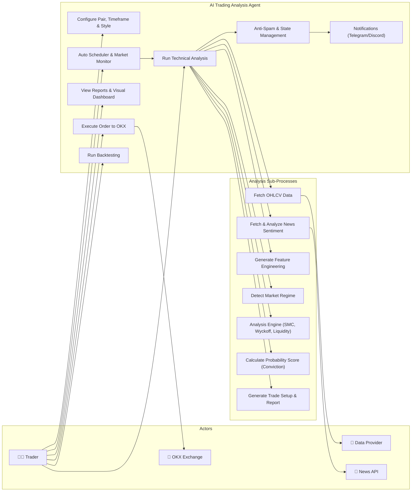
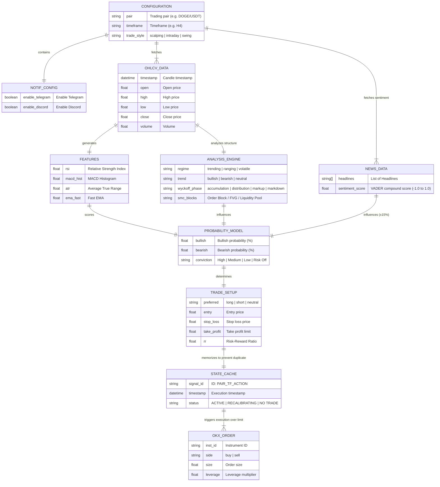
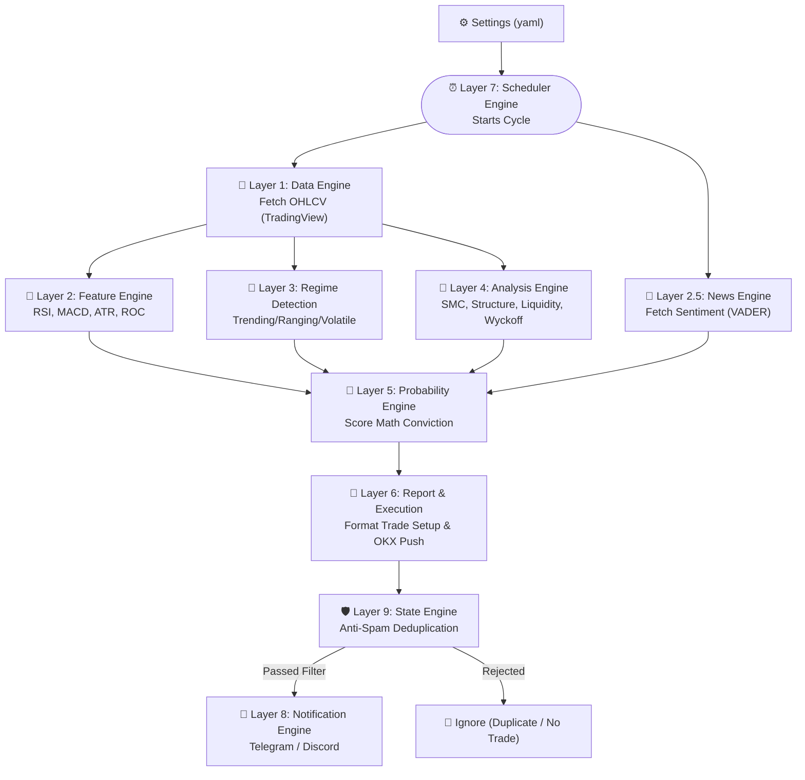

# 🤖 AntiGravity: AI Trading Analysis Agent

[](https://www.python.org/downloads/)
[](https://opensource.org/licenses/MIT)

**AntiGravity AI Trading Analysis Agent** is an advanced artificial intelligence system specifically designed to generate structured technical analysis reports, perform bulk market scanning, and deliver high-probability recommendations (trade setups) based on OHLCV data.

The system is highly flexible and can be used to detect *alpha* (profit opportunities) across various financial markets, including **Crypto (CEX & DEX such as Solana/Base), Forex, Stocks, and Global Indices**.

---

## ✨ Key Features

1. **6-Layer Analysis Architecture**:
   - **Data Engine**: Fetches the latest data via TradingView syntax (`tvdatafeed`).
   - **Feature Engine**: Technical feature extraction (RSI, MACD, ATR, ROC, etc.).
   - **Regime Detection**: Identifies *Market Regime* (Trending, Ranging, Volatile).
   - **Analysis Engine**: Price structure analysis (*Market Structure*), Wyckoff phases, Supply/Demand, Liquidity, and *Smart Money Concepts* (SMC/FVG).
   - **Probability Engine**: Calculates probability metrics with *Timeframe* (TF) awareness and weights *Conviction* ratios (Confidence: *High, Medium, Low*).
   - **Report/Execution Engine**: Generates comprehensive trading summary reports, precise Entry/TP/SL setups (considering FVG Consequent Encroachment), and automated execution.

2. **Multi-Market Support**: Covers Crypto, Forex, Stocks, and Index markets.
3. **Interactive Web Dashboard**: Monitor market status in *real-time* directly in your browser via a comprehensive Dashboard system, featuring liquidity filters, capitalization (FDV), and trends.
4. **OKX Execution Module**: Enables simulation and *Live Trading* through the OKX API, complete with Risk Management adjustments, Leverage, order direction (Long/Short), and *Initial Margin* calculation.
5. **Multi-Threaded Bulk Scanner**: Capable of scanning up to **200 asset pairs** in ~5 minutes with ⚡ Fast mode, equipped with smart rate-limiting, retry logic, and global macro caching.

---

## 📁 Project Directory Structure (Deep Dive)

The system is built on a Modular 6-Layer architecture, where each component is placed in a separate *folder* according to its function (*Separation of Concerns*). Below is a detailed mapping of all internal files powering this AI:

```text
ai-trading-analysis-agent/
│
├── ⚙️ Main Execution Scripts
│   ├── app.py                      # Runs the Web Server (UI GUI Dashboard) on localhost.
│   ├── main.py                     # Pure CLI script to generate text logs for a single pair.
│   └── scanner.py                  # Main Bulk Scanner engine with multi-threading performance.
│
├── ⚙️ Central Configuration
│   └── config/
│       └── settings.yaml           # Your control target (TF, style, Market, OKX API Key, simulated/live mode).
│
├── 🧠 Layer 1: Data Engine
│   └── data_engine/                # Real Data Fetching Module
│       ├── market_data.py          # Candlestick (OHLCV) formatting and validation logic.
│       └── tradingview_connector.py# Bridge module (tvdatafeed) connecting to TradingView data API.
│
├── 🧠 Layer 2: Feature Engine
│   └── feature_engine/             # Processes raw prices into technical feature foundations
│       ├── feature_extractor.py    # Coordinator for calling all indicator extractions.
│       ├── indicator_features.py   # Calculates MACD, RSI, ATR, ROC, and Exponential Moving Averages (EMAs).
│       ├── liquidity_features.py   # Measures volume spikes, volatility anomalies, and liquidity deviations.
│       └── structure_features.py   # Detects Swing Highs and Swing Lows.
│
├── 🆕 Layer 2.5: News Engine
│   └── news_engine/                # Real-Time News Sentiment Analysis Module
│       ├── news_fetcher.py         # Pulls news feeds from NewsAPI / CryptoPanic.
│       ├── sentiment_analyzer.py   # Analyzes text sentiment using VADER or HuggingFace algorithms.
│       └── sentiment_score.py      # Merges news sentiment score metrics into probability_model.py calculations.
│
├── 🧠 Layer 3: Regime Detection
│   └── market_regime_detection/    # Classifies the current market personality
│       ├── regime_classifier.py    # Determines general status by percentage (Trending vs Choppy vs Volatile).
│       ├── trend_detector.py       # Scans absolute trend strength using Averages.
│       └── volatility_model.py     # Measures volatility explosion anomalies (*Breakout Indicator*).
│
├── 🧠 Layer 4: Analysis Engine
│   └── analysis_engine/            # Brain/Core of the Deepest Trading Analysis Logic
│       ├── smc_analysis.py         # Detects Fair Value Gaps (FVG) and *Consequent Encroachment* (FVG midpoint).
│       ├── market_structure.py     # Identifies momentum/fractal shifts (ChoCh) and continuation bias (BoS).
│       ├── liquidity_analysis.py   # Locates Liquidity Pools / Stop Loss hunters (Buy-Side/Sell-Side Liquidity).
│       ├── supply_demand.py        # Maps Bulk Order Areas / *Order Blocks* (Supply and Demand).
│       └── wyckoff_phase.py        # Recognizes Wyckoff Phases (Accumulation, Distribution, Markup, Markdown).
│
├── 🧠 Layer 5: Probability Model
│   └── probability_engine/         # The Final Decision-Making Judge
│       ├── probability_model.py    # Unifies data from Layer 1 through Layer 4 & weights Multi-Timeframe probabilities.
│       └── scoring_engine.py       # Produces the final *Conviction* calculation (labels High/Medium/Low Conviction).
│
├── 🧠 Layer 6: Execution & Reporting
│   ├── report_engine/              # Textual Console Data Visualization Hub
│   │   ├── analysis_report.py      # Template/schema for data object representation structure.
│   │   └── report_formatter.py     # Prints the aesthetic & colorful *"16-Stage Textual Analysis"* in the Console Terminal.
│   │
│   └── execution_engine/           # (Optional Module) OKX Automated Robot Execution
│       ├── okx_integration.py      # *Risk Management* controller, Margin safety limiter, and *Leverage* calculator.
│       └── okx_client.py           # Executor that sends Long/Short signal payloads directly to OKX Web.
│
├── 🆕 Layer 7: Scheduler Engine
│   └── scheduler_engine/           # Auto-looping Routine
│       ├── auto_scheduler.py       # Uses APScheduler — runs scanning every X minutes automatically.
│       ├── market_monitor.py       # Monitors and detects signal changes between runs.
│       └── alert_trigger.py        # Filters for specific "High Conviction" signals before deciding to fire notifications.
│
├── 🆕 Layer 8: Notification Engine
│   └── notification_engine/        # Alert Broadcasting Output Chain
│       ├── telegram_notifier.py    # Sends execution signal summaries to your dedicated Telegram Bot account.
│       ├── discord_notifier.py     # Optional executor: broadcasts messages via Discord Server Webhook.
│       └── message_formatter.py    # Reformats raw signal text objects to look clean, colorful & informative.
│
├── 🆕 Layer 9: State Engine
│   └── state_engine/               # Anti-Spam Signal & History Memory System
│       ├── signal_cache.py         # Stores the latest historical signal status (using SQLite / Redis).
│       └── dedup_filter.py         # Blocks duplicate alert repetitions / prevents constant notification spam.
│
├── 🧪 Backtesting & Simulator (Optional)
│   └── backtesting_engine/         # Historical simulation testing tools
│       ├── backtest_runner.py      # Algorithm test iteration cycle.
│       ├── strategy_simulator.py   # Converts text signals to simulated empty wallet execution entries.
│       └── performance_metrics.py  # Success metric calculator (% Win-Rate, *Drawdown*, Profit & Loss).
│
└── 🌐 Web Dashboard UI Module
    ├── static/                     
    │   ├── css/style.css           # UI web application styling (*Styling*) file.
    │   └── js/app.js               # *Front-end* bridge logic, pulling JSON from the scanner to the website display.
    │
    └── templates/                  
        └── index.html              # *Blueprint Main Layout* / Core structure of your Scanner Market Table.
```

---

## 💻 System Prerequisites

Before running this system, ensure your device meets the following requirements:
*   **Python:** Version 3.10 or later.
*   **Stable Internet Connection:** Used for *real-time* data scraping and TradingView/API connections.
*   (Optional) **TradingView** account credentials to prevent _rate-limiting_ from anonymous session usage.

---

## 🛠 Installation

Download or clone this repository, then set up a *Virtual Environment* to keep your Python library architecture clean:

```bash
# 1. Create virtual environment (one-time only)
py -3 -m venv .venv

# 2. Activate virtual environment (Windows)
.\.venv\Scripts\activate

# 3. Install all required dependencies
py -3 -m pip install -r requirements.txt
```

---

## 🚀 Daily Usage (Using the Web Dashboard)

If you want to use the User Interface/UI version (highly recommended for bulk data visibility), follow these 3 steps every time you start your computer:

### 1. Navigate to Folder & Activate VENV Environment
Open a `Command Prompt` (CMD) / `PowerShell` terminal. Run the initialization script:
```bash
cd ai-trading-analysis-agent
.\.venv\Scripts\activate
```

### 2. Run the Market Scanner Module and Local Web Server
You need to run the main server while calling the scanner module (you can specify specific market categories):
```bash
# A. Run the Central Web Server
py -3 app.py

# B. (Open a NEW Terminal Window) -> activate .venv -> then run scanner:
# ⚡ Fast scan (default) - 200 crypto pairs in ~5 minutes
py -3 scanner.py --market crypto --timeframe 1h --style swing

# 🔍 Full analysis (slower, but includes HTF trend, news, correlation)
py -3 scanner.py --market crypto --timeframe 1h --style swing --full
```

*Tips:* You can configure the number of threads and choose specific markets:
```bash
# Crypto 200 pairs, 8 threads (safe recommendation)
py -3 scanner.py --market crypto --timeframe 1h --style swing --threads 8

# Forex, Stocks, Indexes
py -3 scanner.py --market forex --timeframe 1h --style swing
py -3 scanner.py --market stocks --timeframe 1d --style swing
py -3 scanner.py --market indexes --timeframe 1d --style swing

# All markets at once (crypto + forex + stocks + indexes)
py -3 scanner.py --market all --timeframe 1h --style swing
```

### 3. Monitor the Scanner Dashboard via Browser 🌐
Keep both Terminal windows **running and do not close them**. Open Google Chrome or Microsoft Edge to access your interface at:
👉 **[http://localhost:5000](http://localhost:5000)**

---

## ⚙️ Running the Pure Text Version (For Programmers/Trader Logs)

If you want to see detailed structural data calculations step by step in a conventional *Log Analysis* format, call the main `main.py` script using the `--pair` argument:

```bash
py -3 main.py --pair BINANCE:BTCUSDT --timeframe 1h --limit 500
```
(This will provide a detailed response including the probability *Setup Signal* output.)

---

## 📝 Core Configuration (`config/settings.yaml`)

Edit the main configuration file (located at `config/settings.yaml`) to customize your *Agent's* default trading method:
```yaml
pair: BTC/USDT           # Base Pair
timeframe: H4            # Base Evaluation TF
limit: 500               # Maximum Candle Index 
trade_style: swing       # Style Options: scalping, intraday, swing, position
# -- TradingView Rate-Limit Protection Configuration --
tv_username: ""          # Login recommended
tv_password: ""          
```

---

## 📊 Fully Supported Pair / Symbol Formats

The engine reads API *Ticker* data exactly as named in **TradingView** chart format.

### Required Format (Explicit/Recommended):
Use the `EXCHANGE_NAME:SYMBOL_NAME` syntax to eliminate price liquidity data inaccuracies.

*   **Crypto Sector:** `BINANCE:BTCUSDT`, `BYBIT:ETHUSDT`, `OKX:SOLUSDT`, `KUCOIN:KASUSDT`
*   **Stocks Sector:** `NASDAQ:AAPL`, `NASDAQ:MSFT`, `NYSE:TSLA`, `NYSE:NVDA`
*   **Forex Sector:** `FX_IDC:EURUSD`, `FX_IDC:GBPUSD`, `OANDA:USDJPY`, `OANDA:USDCAD`
*   **Index Sector:** `SP:SPX`, `NASDAQ:NDX`, `TVC:DXY` (Dollar Index)

### Supported Timeframes:
*   **Intraday Trading:** `1m`, `3m`, `5m`, `15m`, `30m`
*   **Swing / Macro Trading:** `1h`, `2h`, `3h`, `4h`, `1d`, `1w`, `1mo`

---

## 🔐 OKX Exchange Execution Integration (Advanced Setup)

This Agent is designed to connect probability analysis results directly to wallet execution on the centralized exchange (**OKX**).
**First**, store your OKX access keys (API) in your *Terminal/Computer's Environment (ENV)* session securely:
```powershell
$env:OKX_API_KEY="..."
$env:OKX_API_SECRET="..."
$env:OKX_PASSPHRASE="..."
```

### A. Setting Up Spot Market Execution (Physical)
Ensure the target pair follows *Cash* without the "SWAP" suffix, and the order _Size_ value is `0`:
```yaml
okx:
  enable: true
  mode: simulated       # Use 'live' when you want to use real funds
  inst_id: "BTC-USDT"   # BASE-QUOTE PAIR ONLY (WITHOUT SWAP)
  trade_mode: cash 
  order_notional: 10    # BUY worth 10 USDT
  order_size: 0         # <- Must be '0' when notional is used
  leverage: 0           # Leverage left at 0 (not valid for Spot)
```

### B. Setting Up Futures/Derivatives Market Execution (SWAP)
You must use the `order_size` option (Contract Lot Value) with the _SWAP_ suffix on the instrument:
```yaml
okx:
  enable: true
  mode: simulated
  inst_id: "BTC-USDT-SWAP" # SWAP IS MANDATORY FOR FUTURES
  trade_mode: isolated
  mgn_mode: isolated
  leverage: 5              # Set your Margin lever (e.g., 5x)
  order_size: 1            # How many contract lots? (Whole numbers: 1, 2, etc.)
  order_notional: 0        # <- MUST BE '0'
  pos_side: auto           # AI determines whether to go Long or Short
  submit: preferred
```

### C. Important! Understanding OKX Futures Margin
_1 Contract on OKX (when setting order_size = 1) does NOT mean 1 full coin. Each coin's contract value is regulated differently._

*   **BTC-USDT-SWAP** : 1 Contract = `0.01 BTC` (approximately $900 to $1000)
*   **ETH-USDT-SWAP** : 1 Contract = `0.1 ETH` (approximately $300 USDT)
*   **SOL-USDT-SWAP** : 1 Contract = `1 SOL` (approximately $150 to $180)
*   **DOGE-USDT-SWAP**: 1 Contract = `1000 DOGE` (approximately $15 to $150)

> **Real Calculation Example (DOGE-USDT-SWAP)**:
> - **Current price**: $0.093
> - **Notional Value** for 1 Contract (1000 DOGE): $0.093 * 1000 = **$93.00**
> - **Required Margin** at **20x** leverage: `$93.00 / 20 = $4.65`
> 
> *This means your Futures wallet balance is only debited `$4.65` to hold a position worth `1000 DOGE`. However, pay attention to the liquidation price.*

### D. OKX SSL Troubleshooting
If you encounter an error like `CERTIFICATE_VERIFY_FAILED`:
1. Synchronize your **Windows Computer Clock** to the international timezone via _Update Now_.
2. If the issue persists, change the parameter `ssl_verify: false` in the config (Warning: less secure).

---

## ⚡ Scanner Performance Tuning

The scanner has been optimized to scan **200 crypto pairs** (from CoinMarketCap top market cap) at high speed. The pair list is stored in `ctval.txt`.

### Scan Modes

| Mode | Flag | Features | Estimate for 200 pairs |
|------|------|----------|------------------------|
| **⚡ Fast** (default) | `--fast` | Skips HTF trend, news, per-pair correlation | **~3-5 minutes** |
| **🔍 Full** | `--full` | Includes everything: HTF, news sentiment, BTC-DXY/SPX correlation | **~15-20 minutes** |

### Scanner Parameters

| Flag | Options | Default | Description |
|------|---------|---------|-------------|
| `--market` | `crypto`, `forex`, `stocks`, `indexes`, `all` | `crypto` | Target market |
| `--timeframe` | `1m`-`1mo` | `1h` | Analysis timeframe |
| `--style` | `scalping`, `intraday`, `swing` | `swing` | Trading style |
| `--threads` | `1`-`15` | `10` | Number of parallel threads |
| `--fast` | - | `on` | Fast mode (default active) |
| `--full` | - | `off` | Full analysis mode |

### Thread Recommendations

| Threads | Speed | Rate-Limit Risk |
|---------|-------|-----------------|
| `5-8` | ~0.5-0.8 pairs/sec | ✅ Very safe |
| `10` | ~1.0-1.5 pairs/sec | ✅ Safe (default) |
| `12-15` | ~1.5-2.0 pairs/sec | ⚠️ Occasional 429 errors |

### Anti Rate-Limit Architecture

The scanner uses several mechanisms to prevent blocking from TradingView:

1. **Global Rate Limiter** (`tradingview_connector.py`): Minimum 150ms delay between each API request, applies to all threads.
2. **Global Macro Cache** (`main.py`): DXY/VIX/SPX data cached for 5 minutes — no need to re-fetch per pair (saves ~300 API calls).
3. **Retry with Backoff** (`market_data.py`): 2x retry per exchange with exponential delay.
4. **Exchange Fallback Chain**: BINANCE → OKX → BYBIT → MEXC → GATEIO → KuCoin.
5. **News Cache** (`news_fetcher.py`): News results cached for 15 minutes.
6. **OHLCV Data Cache**: 5-minute cache per pair/timeframe in `tradingview_connector.py`.
7. **Thread-Safe Singleton**: Single TvDatafeed instance, lock-protected, shared across all threads.

### 200 Pair List (`ctval.txt`)

The pair list is sourced from **CoinGecko/CoinMarketCap top market cap**, with the following exclusions:
- ❌ Stablecoins (USDT, USDC, DAI, USDE, USDD, etc.)
- ❌ Gold/Silver tokens (XAUT, PAXG, KAU, KAG)
- ❌ Institutional/Treasury tokens (BUIDL, JTRSY, OUSG, etc.)
- ❌ Non-tradeable tokens (Figure HELOC, Canton, etc.)

To update the list, edit the `ctval.txt` file with format: `SYMBOL-USDT-SWAP:BINANCE`

---

## 📰 Layer 2.5: News Sentiment Engine (NLP)

The robot now doesn't just read *Candlesticks* — it also reads **news**. The `news_engine/` module pulls the latest *headlines* automatically via the `gnews` library (no API key required), analyzes text sentiment using the **VADER NLP** algorithm, and injects the results into the probability score calculation (`probability_model.py`).

> **Note:** In `--fast` mode (default scanner), news sentiment is skipped for speed. Use `--full` or `main.py` for complete analysis including news.

**How it works:**
1. When `main.py` or `scanner.py --full` processes a pair, the system calls `news_engine.sentiment_score.get_asset_sentiment()`.
2. `gnews` pulls the 5 latest headlines related to the asset.
3. `vaderSentiment` calculates a compound score `[-1.0, +1.0]` per headline, then averages them.
4. This score influences the final Conviction by up to **±15%** in the probability model.
5. The system has an internal *cache* of 15 minutes to prevent excessive calls to `gnews`.

**Configuration (`config/settings.yaml`):**
```yaml
news:
  enable: true
  source: "gnews"          # Free, no token required
  cryptopanic_token: ""    # Optional for future development
```

---

## ⏰ Layer 7: Auto Scheduler Engine (Automatic Loop)

No more typing scanner commands repeatedly. The `scheduler_engine/` module allows the robot to run continuously and automatically, performing periodic scanning, and *only* sending notifications when high-conviction signals are found.

**How to run Auto-Loop:**
```bash
cd ai-trading-analysis-agent
.\.venv\Scripts\activate
py -3 scheduler_engine/auto_scheduler.py
```

**Supported arguments:**

| Flag | Options | Default | Description |
|---|---|---|---|
| `--market` | `crypto`, `forex`, `stocks`, `indexes`, `all` | `crypto` | Target scanner market |
| `--timeframe` | `5m`, `15m`, `1h`, `4h`, `1d`, etc. | `1h` | Analysis timeframe |
| `--style` | `scalping`, `intraday`, `swing` | `swing` | Trading style |
| `--interval` | number (minutes) | `60` | Automatic loop interval |

**Flexible usage examples:**
```bash
# Default: Crypto 1H Swing, repeats every 60 minutes
py -3 scheduler_engine/auto_scheduler.py

# Crypto 15M Scalping, repeats every 15 minutes
py -3 scheduler_engine/auto_scheduler.py --timeframe 15m --style scalping --interval 15

# Forex 4H Swing, repeats every 4 hours
py -3 scheduler_engine/auto_scheduler.py --market forex --timeframe 4h --style swing --interval 240

# All markets at once, 1H, repeats every 1 hour
py -3 scheduler_engine/auto_scheduler.py --market all --timeframe 1h --interval 60
```

**Behavior:**
- On first run, it automatically performs a *bootstrap scan* once without waiting for the interval.
- After bootstrap completes, the system repeats scanning every `--interval` minutes continuously.
- Only **High Conviction (>70%)** signals are forwarded to the notification chain.

**Scheduler execution chain flow:**
```
auto_scheduler.py (APScheduler every X minutes)
  └─→ market_monitor.py (Scan all pairs, build report)
       └─→ alert_trigger.py (Filter: only Conviction > 70%)
            └─→ state_engine/dedup_filter.py (Check: already sent?)
                 └─→ notification_engine/ (Send to Telegram/Discord!)
```

---

## 🔔 Layer 8: Notification Engine (Telegram & Discord)

*High Conviction* signals are sent directly to your phone without needing to monitor the dashboard.

**Credential Storage (Hybrid Model):**
- **General config** → `config/settings.yaml` (enables/disables platforms)
- **Secret tokens** → `.env` file in the root folder (NOT uploaded to Git)

**Step 1: Create a `.env` file in the root folder**
```env
TELEGRAM_BOT_TOKEN="1234567890:ABCDEFGHIJKLMNOPQRSTUVWXYZ"
TELEGRAM_CHAT_ID="12345678"
DISCORD_WEBHOOK_URL="https://discord.com/api/webhooks/xxx/yyy"
```
> **How to get a Telegram token:**
> 1. Open Telegram, search for `@BotFather` → type `/newbot` → follow instructions → note down the Token.
> 2. Send any message to your new bot, then open `https://api.telegram.org/bot<TOKEN>/getUpdates` in your browser to get the `chat_id`.

**Step 2: Enable in config**
```yaml
notifications:
  enable_telegram: true
  enable_discord: false       # Set 'true' if you want to use Discord too
```

**Message format sent:**
```
🟢 **AI Trading Alert: DOGE/USDT**
**Direction:** LONG
**Conviction Score:** 78.5%
**Action Level:** ENTER

🎯 **Trade Setup**
• **Entry:** $0.093200
• **Stop Loss:** $0.088500
• **Take Profit 1:** $0.098100
• **Take Profit 2:** $0.102800
```

---

## 🛡 Layer 9: State Engine (Anti-Spam & Memory)

Without this module, a robot running on a 15-minute loop would send **identical** notifications repeatedly. `state_engine/` prevents this:

- **`signal_cache.py`**: Stores the latest signal history in `state_engine/signal_cache.json` (automatically created).
- **`dedup_filter.py`**: Checks whether the same signal (`PAIR + TIMEFRAME + ACTION`) has already been sent within the last **120 minutes**.
- Signals of type `NO TRADE`, `RISK OFF`, or `RECALIBRATING` are **always filtered** and never sent.

**Behavior:**
| Condition | Result |
|---|---|
| DOGE LONG sent 30 minutes ago | ❌ Blocked (120-minute cooldown) |
| DOGE LONG sent 3 hours ago | ✅ Re-sent (cooldown expired) |
| DOGE SHORT (new) | ✅ Sent (different action) |
| Signal NO TRADE | ❌ Always filtered |

---

## 🖨 Final Analysis Output Summary (Console Report)
Once calculations are complete, the robot will present a *Complete 16-Stage Analytical Text Dashboard*:
- Market Cycle Evaluation *(Correction/Impulsive)*.
- Wyckoff Methodology Phase Recognition *(Accumulation, Distribution)*.
- *Order Block*, Hidden *Fair Value Gap (FVG)*, Liquidity Area *(Buy/Sell Side)* Mapping.
- Risk Calculation & Setup Summary with Patience Threshold (*Conviction Rating* > 70% is considered Strong).
- Precise **Entry** Points, Profit Target **(TP)**, and Safety Net **(SL)** Details.

---

## 1. Use Case Diagram

The Use Case Diagram illustrates the interaction between actors (users) and the system's main features.

### 1.1 Actors

| Actor | Description |
|-------|-------------|
| **Trader (User)** | The user who operates the system through the Web Dashboard or CLI to perform analysis and trading execution. |
| **OKX Exchange** | The cryptocurrency exchange platform that receives orders from the system. |
| **Data Provider (TradingView)** | OHLCV data provider through the tvdatafeed library from various exchanges. |
| **News API (gnews)** | News headline data provider for NLP sentiment analysis. |

### 1.2 Diagram



### 1.3 Use Case Descriptions

| # | Use Case | Description |
|---|----------|-------------|
| UC1 | **Configure Pair, Timeframe & Style** | Trader sets basic options via `settings.yaml` file (Pair, Timeframe, Style, Simulated/Live, Alerts). |
| UC2 | **Run Technical Analysis** | System fetches OHLCV data and news, runs sentiment weight & feature extraction, market regime, SMC, Wyckoff, liquidity, supply/demand, measures directional conviction probability, then generates precise trade setups. |
| UC3 | **Auto Scheduler & Market Monitor** | System performs periodic scanning cycles (automatically every X minutes) to recap updated market conditions. |
| UC4 | **Anti-Spam & State Management** | System holds/blocks notification delivery if it has already emitted a signal/setup for the same market status ID (Pair + TF + Action) to prevent repetitive spam. |
| UC5 | **Notifications (Telegram/Discord)** | After analysis results successfully pass the _high conviction_ score filter (greater than 70%) and are verified as not yet sent via the anti-spam filter, the system fires analysis log summaries via bot. |
| UC6 | **View Reports & Visual Dashboard** | Trader option to simply monitor output on the GUI (Web), or the 16-stage textual analysis Console Terminal screen. |
| UC7 | **Execute Order to OKX** | Sends limit orders equipped with safety nets (_Take Profit_, _Stop Loss_) integrated directly to OKX. |
| UC8 | **Run Backtesting** | Simulates Win-Rate performance ratio using the backtesting engine to validate conviction foundations. |

---

## 2. Entity Relationship Diagram (ERD)

The ERD illustrates the main data structures used by the system and the relationships between entities.

> **Note:** This system is based on **in-memory processing** (does not use a relational database), so this ERD represents the relationships between data structures (dataclass, dict, DataFrame) flowing within the pipeline.

### 2.1 Diagram



### 2.2 Relationship Descriptions

| Relationship | Description |
|--------------|-------------|
| `CONFIGURATION` → `OHLCV_DATA` | Pair and timeframe configuration determines what data is fetched via the Data Engine (TradingView). |
| `CONFIGURATION` → `NEWS_DATA` | Configuration determines the asset pair queried to gnews. |
| `OHLCV_DATA` → `ANALYSIS_ENGINE` | Candles are classified to formulate Market Structure, Wyckoff, Liquidity, and SMC. |
| `NEWS_DATA` + `FEATURES` + `ANALYSIS_ENGINE` → `PROBABILITY_MODEL` | Mass media sentiment data is combined with analytical fundamental calculations to form a reliable Conviction percentage (Low, Medium, High). |
| `PROBABILITY_MODEL` → `TRADE_SETUP` | The highest probability level crowns the Long or Short bias, along with precise Take Profit & Stop-Loss. |
| `TRADE_SETUP` → `STATE_CACHE` | Each generated signal must pass State Engine deduplication verification. If duplicate/repetitive, the signal is held. |
| `STATE_CACHE` → Notification & `OKX_ORDER` | If it passes the filter (not spam), the instruction is fired to the Notification layer (Telegram) and OKX Order Limit API. |

---

## 3. Pipeline Architecture (Data Flow)

Below is the Flowchart mapping for the 9-Layer Architecture:



---

## 4. Module to Code Structure Mapping

Based on the main modular architecture:

| Layer (README Version) | Engine Module | Main Files |
|------------------------|---------------|------------|
| **Layer 1** | `data_engine/` | `tradingview_connector.py`, `market_data.py` |
| **Layer 2** | `feature_engine/` | `feature_extractor.py`, `indicator_features.py`, `liquidity_features.py` |
| **Layer 2.5** | `news_engine/` | `news_fetcher.py`, `sentiment_analyzer.py`, `sentiment_score.py` |
| **Layer 3** | `market_regime_detection/` | `regime_classifier.py`, `trend_detector.py`, `volatility_model.py` |
| **Layer 4** | `analysis_engine/` | `market_structure.py`, `smc_analysis.py`, `liquidity_analysis.py`, `wyckoff_phase.py`, `supply_demand.py` |
| **Layer 5** | `probability_engine/` | `probability_model.py`, `scoring_engine.py` |
| **Layer 6** | `report_engine/` & `execution_engine/`| `analysis_report.py`, `report_formatter.py`, `okx_integration.py` |
| **Layer 7** | `scheduler_engine/` | `auto_scheduler.py`, `market_monitor.py`, `alert_trigger.py` |
| **Layer 8** | `notification_engine/` | `telegram_notifier.py`, `discord_notifier.py`, `message_formatter.py` |
| **Layer 9** | `state_engine/` | `signal_cache.py`, `dedup_filter.py` |
| **UI Apps** | root | `app.py`, `scanner.py`, `main.py` |


---
**Disclaimer**: Crypto and Capital Market trading carries substantial risk of loss. This AI-based tool is intended purely as a mathematical data calculation assistance extension (Analysis Assistance) and educational simulation tool, and does not constitute risk-free financial advice! Use proper portfolio management.
