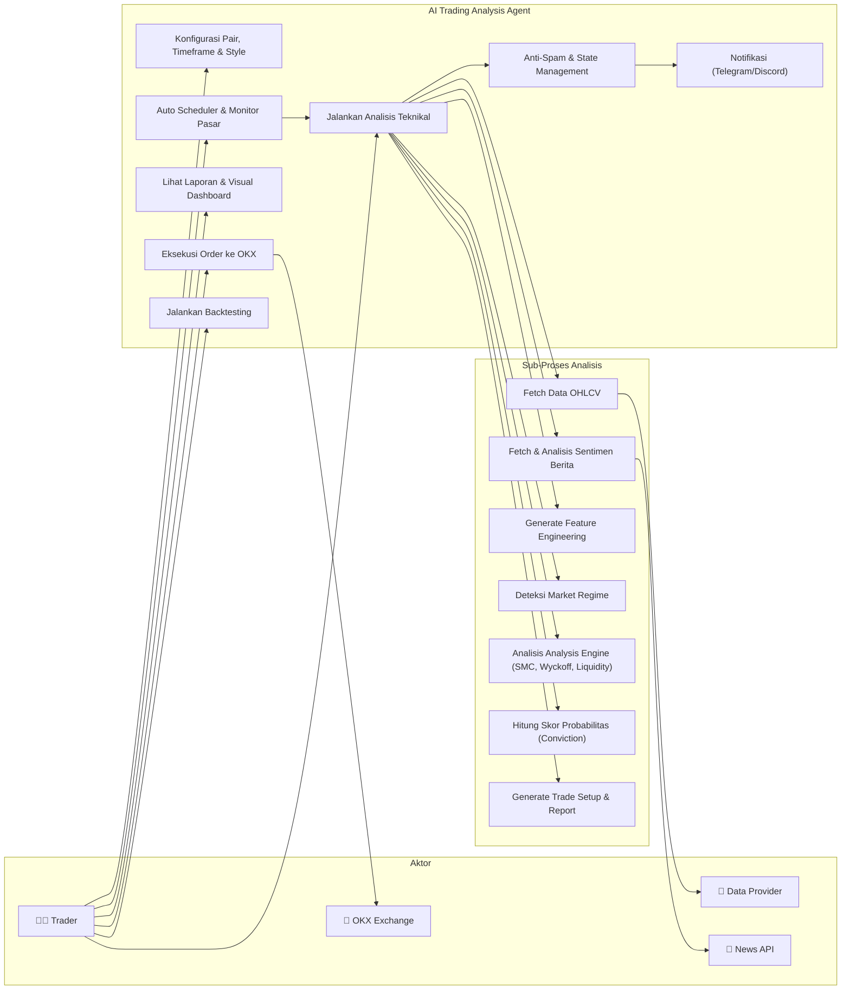
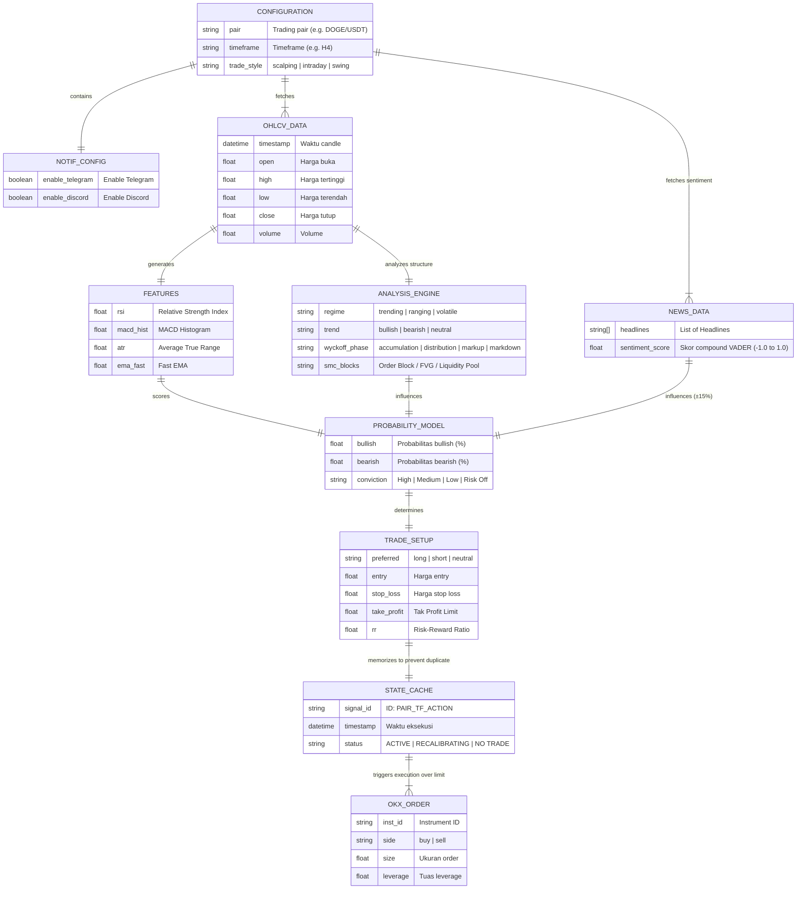
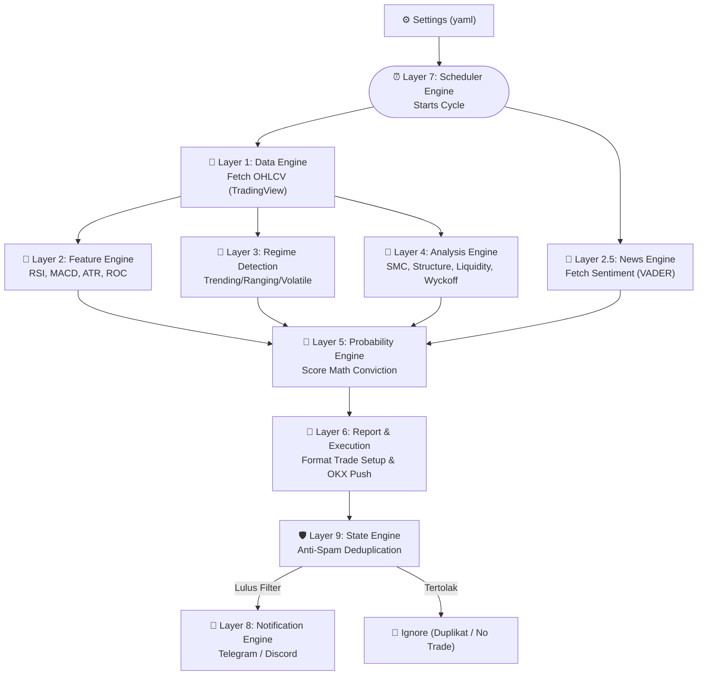

# 📊 AI Trading Analysis Agent — System Diagrams

> Dokumen ini berisi **Use Case Diagram** dan **Entity Relationship Diagram (ERD)** untuk proyek AI Trading Analysis Agent.

---

## 1. Use Case Diagram

Use Case Diagram menggambarkan interaksi antara aktor (pengguna) dengan fitur-fitur utama sistem.

### 1.1 Aktor

| Aktor | Deskripsi |
|-------|-----------|
| **Trader (User)** | Pengguna yang mengoperasikan sistem melalui Web Dashboard atau CLI untuk melakukan analisis dan eksekusi trading. |
| **OKX Exchange** | Platform pertukaran aset kripto yang menerima order dari sistem. |
| **Data Provider (TradingView)** | Penyedia data OHLCV melalui library tvdatafeed dari berbagai exchange. |
| **News API (gnews)** | Penyedia data headline berita untuk analisis NLP sentimen. |

### 1.2 Diagram

### 1.3 Deskripsi Use Case

| # | Use Case | Deskripsi |
|---|----------|-----------|
| UC1 | **Konfigurasi Pair, Timeframe & Style** | Trader mengatur opsi dasar via file `settings.yaml` (Pair, Timeframe, Style, Simulasi/Live, Alerts). |
| UC2 | **Jalankan Analisis Teknikal** | Sistem mengambil data OHLCV dan berita, menjalankan ekstraksi bobot sentimen & fitur, market regime, SMC, Wyckoff, likuiditas, supply/demand, mengukur conviction probabilitas arah, lalu generasikan setup trading presisi. |
| UC3 | **Auto Scheduler & Monitor Pasar** | Sistem melakukan siklus pemindaian berkala (otomatis setiap X menit) demi merekap kondisi pasar yang terbarukan. |
| UC4 | **Anti-Spam & State Management** | Sistem menahan / mem-block pelemparan notifikasi jika sudah pernah memancarkan sinyal/setup pada ID status pasaran (Pair + TF + Action) yang sama guna menanggulangi repetisi spam. |
| UC5 | **Notifikasi (Telegram/Discord)** | Setelah hasil analisa berhasil mendobrak filter skor _high conviction_ (lebih besar dari 70%) dan ter-verifikasi belum dikirim via filter anti-spam, sistem menembakkan rangkuman log analisis via bot. |
| UC6 | **Lihat Laporan & Visual Dashboard** | Opsi trader merelakan diri sekadar memantau output pada GUI (Web), maupun layar Console Terminal 16-tahap analisa textually. |
| UC7 | **Eksekusi Order ke OKX** | Mengirimkan limit order yang dilengkapi dengan jaring pengaman (_Take Profit_, _Stop Loss_) secara terintegrasi langsung menuju OKX. |
| UC8 | **Jalankan Backtesting** | Menyimulasikan rasio Win-Rate performa menggunakan engine backtests demi membuktikan tumpuan conviction. |

---

## 2. Entity Relationship Diagram (ERD)

ERD menggambarkan struktur data utama yang digunakan oleh sistem dan relasi antar entitas.

> **Catatan:** Sistem ini berbasis **in-memory processing** (tidak menggunakan database relasional), sehingga ERD ini merepresentasikan hubungan antar struktur data (dataclass, dict, DataFrame) yang mengalir di dalam pipeline.

### 2.1 Diagram

### 2.2 Penjelasan Relasi

| Relasi | Deskripsi |
|--------|-----------|
| `CONFIGURATION` → `OHLCV_DATA` | Konfigurasi pair dan timeframe menentukan data apa yang di-fetch via Data Engine (TradingView). |
| `CONFIGURATION` → `NEWS_DATA` | Konfigurasi menentukan pair aset yang di-query ke gnews. |
| `OHLCV_DATA` → `ANALYSIS_ENGINE` | Lilin diklasifikasikan memformulasikan Market Structure, Wyckoff, Liquidity, dan SMC. |
| `NEWS_DATA` + `FEATURES` + `ANALYSIS_ENGINE` → `PROBABILITY_MODEL` | Data sentimen media massal digabung perhitungan analitik fundamental dalam membentuk persentase Conviction yang terpercaya (Low, Medium, High). |
| `PROBABILITY_MODEL` → `TRADE_SETUP` | Tingkat probabilitas tertinggi bakal menobatkan bias Long atau Short, juga presisi Take Profit & Stop-Loss. |
| `TRADE_SETUP` → `STATE_CACHE` | Tiap sinyal yang tercipta harus lulus verifikasi deduplikasi State Engine. Apabila duplikat / repetitif, sinyal ditahan. |
| `STATE_CACHE` → Notification & `OKX_ORDER` | Jika lulus sensor (belum spam), instruksi ditembak ke layer Notifikasi (Telegram) dan OKX Order Limit API. |

---

## 3. Arsitektur Pipeline (Alur Data)

Berikut pemetaan Flowchart untuk 9-Layer Architecture:

---

## 4. Mapping Module ke Struktur Kode

Berdasarkan arsitektur modular utama:

| Layer (Versi README) | Engine Module | File Utama |
|----------------------|---------------|------------|
| **Layer 1** | `data_engine/` | `tradingview_connector.py`, `market_data.py` |
| **Layer 2** | `feature_engine/` | `feature_extractor.py`, `indicator_features.py`, `liquidity_features.py` |
| **Layer 2.5** | `news_engine/` | `news_fetcher.py`, `sentiment_analyzer.py`, `sentiment_score.py` |
| **Layer 3** | `market_regime_detection/` | `regime_classifier.py`, `trend_detector.py`, `volatility_model.py` |
| **Layer 4** | `analysis_engine/` | `market_structure.py`, `smc_analysis.py`, `liquidity_analysis.py`, `wyckoff_phase.py`, `supply_demand.py` |
| **Layer 5** | `probability_engine/` | `probability_model.py`, `scoring_engine.py` |
| **Layer 6** | `report_engine/` & `execution_engine/`| `analysis_report.py`, `report_formatter.py`, `okx_integration.py` |
| **Layer 7** | `scheduler_engine/` | `auto_scheduler.py`, `market_monitor.py`, `alert_trigger.py` |
| **Layer 8** | `notification_engine/` | `telegram_notifier.py`, `discord_notifier.py`, `message_formatter.py` |
| **Layer 9** | `state_engine/` | `signal_cache.py`, `dedup_filter.py` |
| **UI Apps** | root | `app.py`, `scanner.py`, `main.py` |
